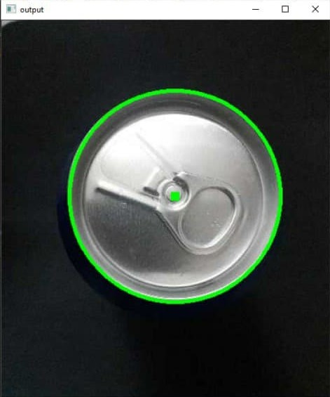

## Automated Conveyor Sorting System
A project that was made for the Peripheral Units Lab, [Damascus University](http://www.damascusuniversity.edu.sy/index.php?lang=2).
### Introduction
Our system can sort multiple products depending on certain quality standards, and we used Pepsi Cans as an example product.
The most challenging part was the design of the conveyor. We made a simple wooden structure to hold the conveyor mechanism and other components and sensors.
### Hardware Parts:
- Arduino Uno Microcontroller
- MG995 Servo 180°
- MG995 Continuous Servo
- 2× Laser Beam Limit Switch (using LDRs and  laser pointers)
- Mobile Camera for Computer Vision
#### Camera
Vision was done by using Mobile Camera  connected to PC using [IP Webcam App](https://play.google.com/store/apps/details?id=com.pas.webcam&hl=en&gl=US), and fixed directly above the conveyor belt.

### Software:
We mainly used [Python](https://www.python.org) for:
- Computer Vision process using [OpenCV](https://opencv.org)
- Designing the GUI
- Setting up the communication between Arduino, Mobile Camera and the User Interface
#### Vision
The main concept was to detect the Pepsi Can then check if it is open or not.
For detecting our circular product we used [Circle Hough Transform](https://en.wikipedia.org/wiki/Circle_Hough_Transform) and choose the largest circle detected so this is our can.

The next step was to detect the hole in the can.

For the first version of our code we used thresholding method by taking the balck color range in HSV color sapce, which represents the hole, and If it exists, it means that the box is rejected, otherwise it is accepted.
However, this method caused some loss in accuracy as a result of being severely affected by the light noise and the difference in the degree of light.

So in the second version we used a more effective method called [Blob Detection](https://docs.opencv.org/3.4/d0/d7a/classcv_1_1SimpleBlobDetector.html) To find the hole that represents connected pixels in the image that share some common property.

#### GUI
The user interface was built with [PyQt5](https://en.wikipedia.org/wiki/PyQt) to help the project perform its functions in an easy manner for the user

